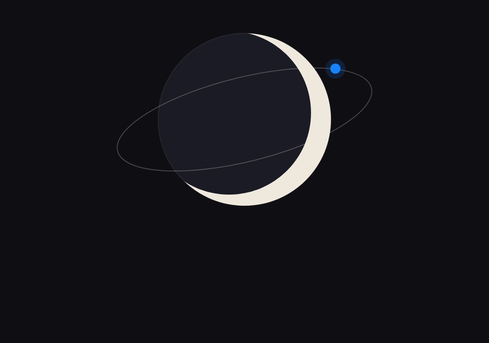
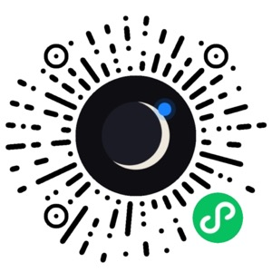
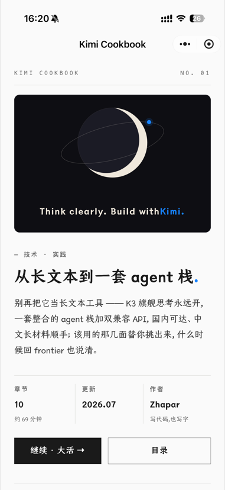
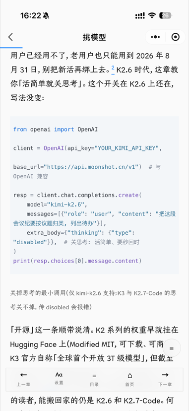
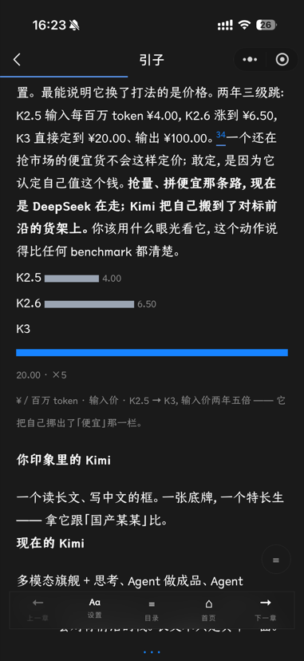
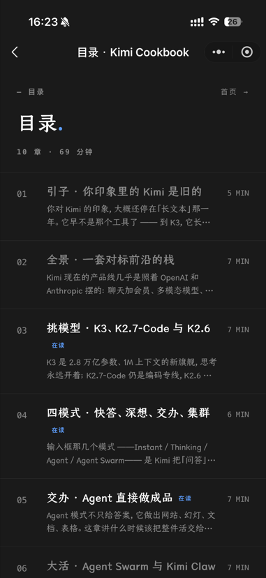
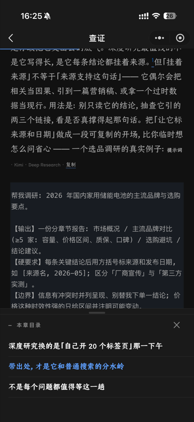
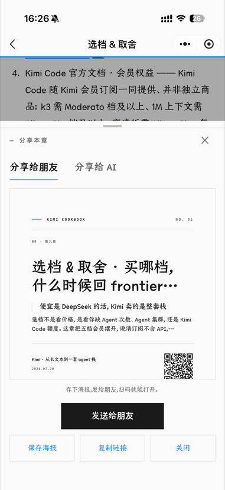

# Kimi Cookbook · 微信小程序

[](LICENSE)
[](https://creativecommons.org/licenses/by-nc-sa/4.0/)

**《Kimi · 从长文本到一套 agent 栈》的阅读端 —— Think clearly. Build with Kimi.**



一本讲透 Kimi 产品栈的书,装进口袋:K3 与模型、四种模式、Agent 与
Agent Swarm、Deep Research、Kimi Code 与开放 API,以及五档会员的取舍。
十章全文,免费在线阅读。

- 网页版(评论 / PDF / llms.md):[kimi.read.wiki](https://kimi.read.wiki/books/kimi)
- 内容源站点仓库:[aklmans/kimi-cookbook](https://github.com/aklmans/kimi-cookbook)
- 本工程是**纯展示层**:站点只读 API(`GET /api/mp/v1/*`)→ 本地缓存 →
  渲染,不含任何内容源

**微信扫码,直接开读:**



## 界面

| 首页 | 阅读(浅) | 阅读(深) |
| --- | --- | --- |
|  |  |  |

| 目录 | 大纲弹层 | 分享弹层 |
| --- | --- | --- |
|  |  |  |

## 功能

**阅读体验**
- 仓耳今楷排版(站点子集字体,失败降级宋体)+ 受限 HTML 子集渲染
- 代码块冷蓝面 + 蓝左条、全宽出血、词边界断行;表格横向滚动
- 章内大纲(浮动 ≡ → 底部弹层,锚点跳转,高亮当前节)
- 脚注弹层(点数字看引文;「全部引用 ↓」落文末,可一键返回引文处)
- 顶部进度条、沉浸式底部栏(下滑收起,毛玻璃)、按比例位置记忆
  (恢复后浮条可一键回开头)、预取下一章
- 长按选中复制、图片点开多图滑动、弹层下滑关闭

**个性化**
- 主题三态(跟随系统 / 浅 / 深),深色全量适配;字号四档点选,
  重排不丢进度

**状态与分享**
- 目录在读 / 已读标记(按「读到章末」计),首页「已读 N / 10」
- 章节分享弹层双 tab:海报 canvas 内联预览可保存、给 AI 的提示词
  (带 llms.md 链接)即拷;十章读完,末章章末「全书完」大卡
- 书页分享卡片:月景图 + 「Think clearly. Build with Kimi.」

## 架构

```
微信开发者工具导入即跑(无 npm / 无构建 / ES modules)
│
├─ pages/book · toc · read · about     四个页面
├─ components/mp-html                  富文本渲染(vendored mp-html v2.5.2)
├─ utils/api.js                        SWR 缓存(1h)+ 阅读状态(全本地 storage)
├─ utils/theme.js                      主题 + readerTagStyle 排版表
└─ utils/poster.js                     分享海报 canvas(章 / 书两级)
            │
            ▼  GET /api/mp/v1/book · /chapters/{slug} · /version
   kimi-cookbook 站点(Next.js,内容唯一来源)
```

阅读状态(已读 / 进度 / 字号 / 主题)全部存在本地,不上传;内容载荷
SWR 缓存 1h,已缓存章节离线可读。

## 开发

- [贡献 / 二开指南](docs/contributing.md):环境搭建、项目结构、内容契约、
  走查清单、资源再生成手册、发布史(v1.0.0 / v1.0.1)
- [设计语言](docs/design.md):色彩 token、字体栈、组件词汇、动效与文案约定

## 项目结构

```
app.js / app.json / app.wxss   全局:主题(浅/深/跟随系统)、设计 token、
                               仓耳今楷 wx.loadFontFace、页面淡入
pages/book/                    首页 = 书页(刊头 NO.01、网页封面卡(CoverVisual
                               栅格化 + 标语文字层)、继续阅读、已读 N/10、
                               骨架屏、分享本书(书级海报弹层))
pages/toc/                     目录(10 章,在读标记、已读置灰,骨架屏)
pages/read/                    阅读器(mp-html + Tsanger 排版,功能见上)
pages/about/                   关于本书(数据驱动:book 载荷 about 字段,
                               内置文案兜底)
components/mp-html/            富文本渲染器(vendored mp-html v2.5.2,
                               dist/mp-weixin,免 npm 构建)
utils/api.js                   内容 API 客户端(SWR 缓存 1h)+ 阅读状态 + 预取
utils/poster.js                海报 canvas(章/书两级,二维码为官方小程序码
                               assets/mp-code.jpg)
utils/theme.js                 主题应用 + mp-html tag-style 排版表(Tsanger 栈)
assets/cover.png               首页封面:站点 CoverVisual 月景栅格化
                               (dev server + Playwright 截图,品牌图变更时重出)
assets/share-card.png          分享卡片图:cover.png 居中裁 5:4(1150×920)
assets/moon-tile.png           月之暗面站标(与网页 favicon 同构图)
assets/mp-code.jpg             官方小程序码(小程序后台下载,扫码开小程序)
```

## Backlog

SVG 图 / 封面卡栅格化、`/api/mp/v1/version` 缓存失效精确化、mp-render
给 img 补宽高(预留高度防漂移)。

## License

- **代码**:[MIT](LICENSE) © Kimi Cookbook contributors
- **书中内容**(含关于页内置文案):[CC BY-NC-SA 4.0](https://creativecommons.org/licenses/by-nc-sa/4.0/) © Zhaphar
- `components/mp-html/`:[MIT](components/mp-html/LICENSE) © Jin Yufeng(vendored)

## Credits

Designed by [Zhaphar](https://x.com/ak_zhaphar) · Built by Kimi Code ——
一本讲 Kimi 的书,它的阅读端由书里的工具自己写成。
写这本书的原由,见[关于本书](https://kimi.read.wiki/about)。

**字体**:正文「仓耳今楷 05」(W04 / W05 字重)由
[仓耳字库](https://tsanger.cn/)设计——感谢仓耳字库开放旗下字体免费下载、
允许个人使用;小程序加载的是站点子集化后的在线字体。

**封面图**:[kimi-cookbook](https://github.com/aklmans/kimi-cookbook) 站点的
CoverVisual 月景(幽灵月盘 + 纸色月牙 + 轨道 + Kimi 蓝卫星),
栅格化为本地资产。
